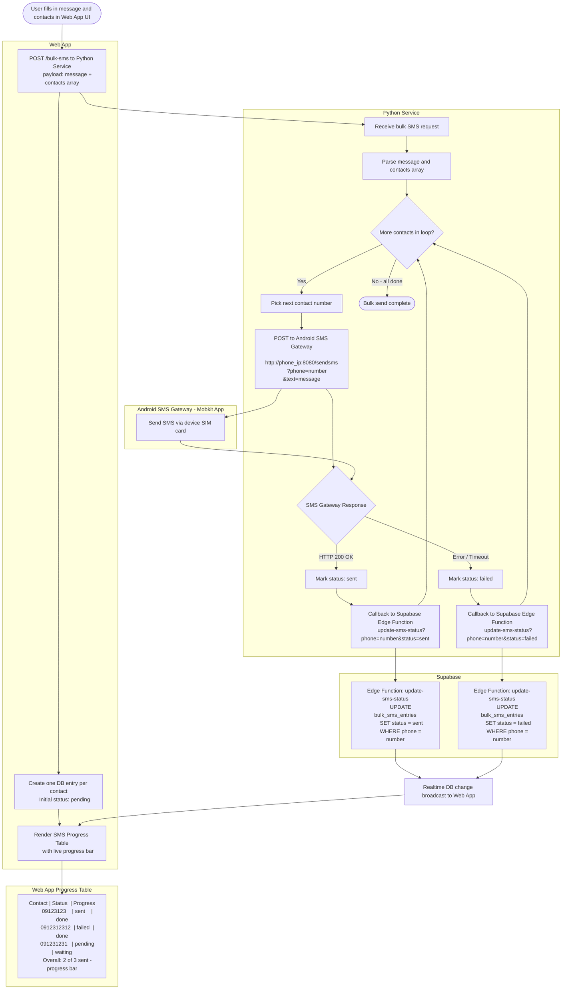

# Bulk SMS System Flowchart



---

## Component Responsibilities

| Component | Role |
|---|---|
| **Web App** | Initiates bulk SMS, creates DB records per contact, renders live progress table |
| **Python Service** | Loops contacts, calls SMS gateway, fires status callbacks to Supabase |
| **Android SMS Gateway (Mobkit)** | Sends actual SMS via device SIM on local network (`192.168.254.XXX:8080`) |
| **Supabase Edge Function** | Updates each contact's status in the database |
| **Web App Table** | Polls or subscribes (realtime) to DB and reflects status + progress bar live |

---

## API Summary

### Web App → Python Service
```
POST /bulk-sms
Content-Type: application/json

{
  "message": "message text here",
  "contacts": ["09123123", "0912312312", "091231231"]
}
```

### Python Service → Mobkit SMS Gateway
```
POST http://<phone_ip_address>:8080/sendsms
      ?phone=<recipient_number>
      &text=<message_content>
```

### Python Service → Supabase Edge Function (callback)
```
POST https://adada.supabase.com/update-sms-status
      ?phone=<recipient_number>
      &status=<sent|failed>
```

---

## Status Lifecycle

```
pending  ──► sending  ──► sent
                     └──► failed
```
