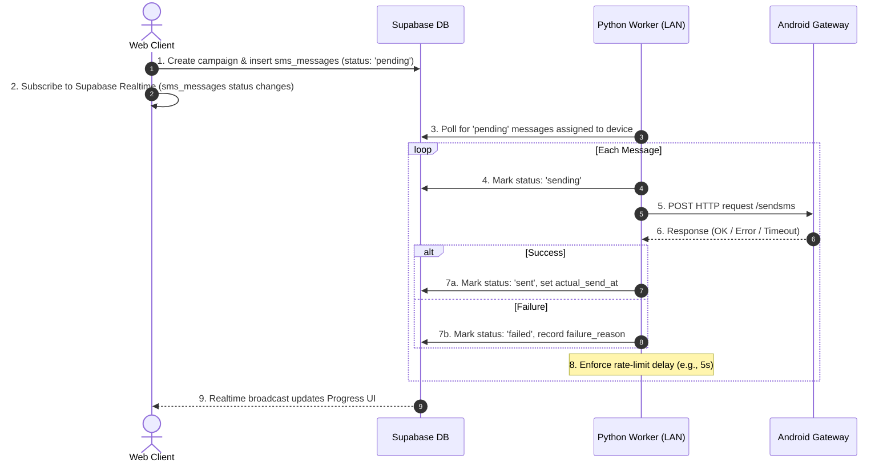

# Implementation Plan: Bulk SMS Workflow with Local Gateway & Python Worker

This implementation plan details how to build and integrate the bulk SMS blaster system. It reconciles the user's flowchart with the existing Next.js + Supabase database structure and schedules a separate Python local network worker to handle actual SMS delivery via the Mobkit/Mymobkit gateway.

---

## Architecture Overview

Instead of hitting the local gateway directly from the Next.js cloud server (which is blocked by local firewalls/CORS), we will use an asynchronous **Pull-based Worker Model**:



---

## Phase 1: Database & Supabase Setups

### 1. Verification of Tables
We will use the existing schema defined in `supabase_schema.sql` rather than creating a new `bulk_sms_entries` table:
*   **`sms_campaigns`**: Header record for tracking the overall batch (status: `draft`, `scheduled`, `sending`, `completed`, `cancelled`).
*   **`sms_messages`**: Individual messages to be sent (status: `pending`, `sending`, `sent`, `failed`, `delivered`).
*   **`android_devices`**: Registered gateway devices (`gateway_url`, `status`).

### 2. Enable Realtime Replication
We must verify/ensure that the `sms_messages` table has **Supabase Realtime** enabled, specifically for updates:
```sql
ALTER PUBLICATION supabase_realtime ADD TABLE public.sms_messages;
```

---

## Phase 2: Web App Frontend & API (Next.js)

### 1. Campaign & Message Ingestion Endpoint
Create a server action or API route `src/app/api/campaigns/create/route.ts` that:
1.  Receives the bulk message content and a list of contact IDs (or group ID).
2.  Creates a record in the `sms_campaigns` table with state `sending`.
3.  Inserts a corresponding row in the `sms_messages` table for each recipient with state `pending`, mapping them to the designated `android_device_id`.

### 2. Live Progress Dashboard UI
Build the bulk progress component using Shadcn UI in `src/components/sms/BulkProgress.tsx`:
*   **Progress Bar**: Dynamically calculates `(Sent + Failed) / Total` messages in real-time.
*   **Realtime Subscription**: Uses `@supabase/supabase-js`'s `.on('postgres_changes')` to capture changes to `sms_messages` where `campaign_id` matches current session.
*   **Details Table**: Lists contacts with status pill changes: `pending` (gray) ➔ `sending` (blue) ➔ `sent` (green) / `failed` (red).

---

## Phase 3: Python LAN Worker (Prepared for Later)

This Python script runs locally within the same LAN as the Android device, pulling tasks from Supabase and forwarding them to Mobkit/Mymobkit.

### 1. Project Directory Structure
```
sms-worker/
├── config.py           # Config variables (Supabase URL, Key, Device ID, Rate Limit)
├── requirements.txt    # dependencies (supabase, httpx, pydantic, dotenv)
├── worker.py           # main loop daemon
└── sms_client.py       # Mobkit REST Client wrapper
```

### 2. Key Libraries (`requirements.txt`)
```text
supabase==2.5.1
httpx==0.27.0
python-dotenv==1.0.1
pydantic==2.7.4
```

### 3. Worker Execution Flow (`worker.py`)
*   **Initialization**: Connects to Supabase using the service role key.
*   **Polling Loop**:
    1.  Fetch the next chunk of messages (e.g., 5 at a time) from `sms_messages` where `status = 'pending'` and `android_device_id` matches the current worker's ID.
    2.  For each message, update status to `sending` in Supabase.
    3.  Call the local Mobkit Gateway API:
        ```http
        POST http://<gateway_ip>:<port>/services/api/messaging/
        Content-Type: application/x-www-form-urlencoded
        
        To=<phone>&Message=<text>
        ```
    4.  Evaluate HTTP response:
        *   **200 OK & Successful JSON**: Mark status `sent`, populate `actual_send_at` and `delivery_report`.
        *   **Failure/Timeout**: Mark status `failed`, write exception traceback into `failure_reason`.
    5.  Wait for `RATE_LIMIT_DELAY` seconds before sending the next message (to avoid SIM carrier blocking).

---

## Verification & Error Handling Checklist

*   [ ] **API Resiliency**: Worker must gracefully catch HTTP connection errors to the Android gateway and mark the message `failed` with descriptive errors (e.g., "Gateway host unreachable").
*   [ ] **Rate Limiting**: Configurable throttle interval (default: 5 seconds) between sending commands.
*   [ ] **Locking Mechanism**: Ensure that only one message is processed at a time per device to prevent message overlapping or double sending.
*   [ ] **Realtime Reconnection**: UI must handle reconnection logic in case the Supabase WebSockets stream disconnects.
